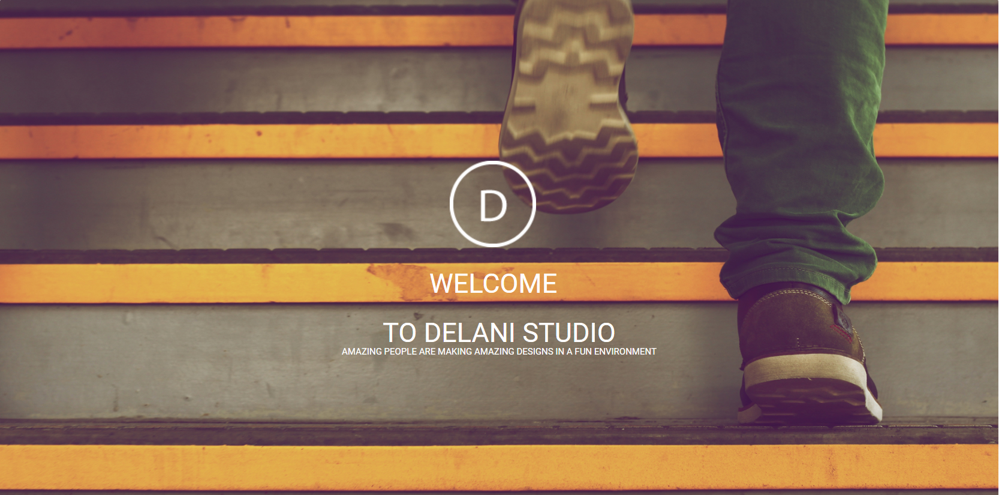

## Delani Studio

## Getting Started
# Prerequisites
_Technologies Used_
* HTML - is the standard markup language the Web page
* CSS - for styling the webpage
* Javascript and jquery - for scripting
* Bootstrap - framework for developing responsive, mobile-first websites

# Live project site
[Checkout the live site](https://mstienei.github.io/delani-studio/)

# Setup Instructions
Page has been set up using html,css,javascript,query and bootstrap

# Contributing
Please feel free to clone the project and build on it.

# Authors
Maureen Sitienei

# Contacts
**email:** mstienei@gmail.com
**mobile:** +25412345678

# License
This project is licensed under the MIT License - see the LICENSE.md file for details
